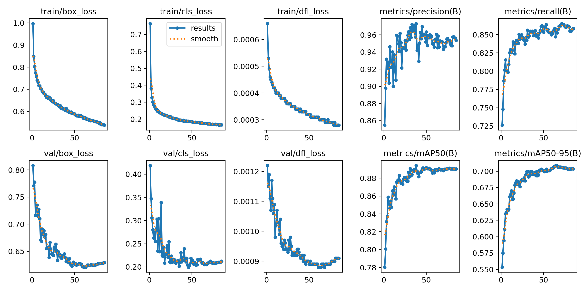
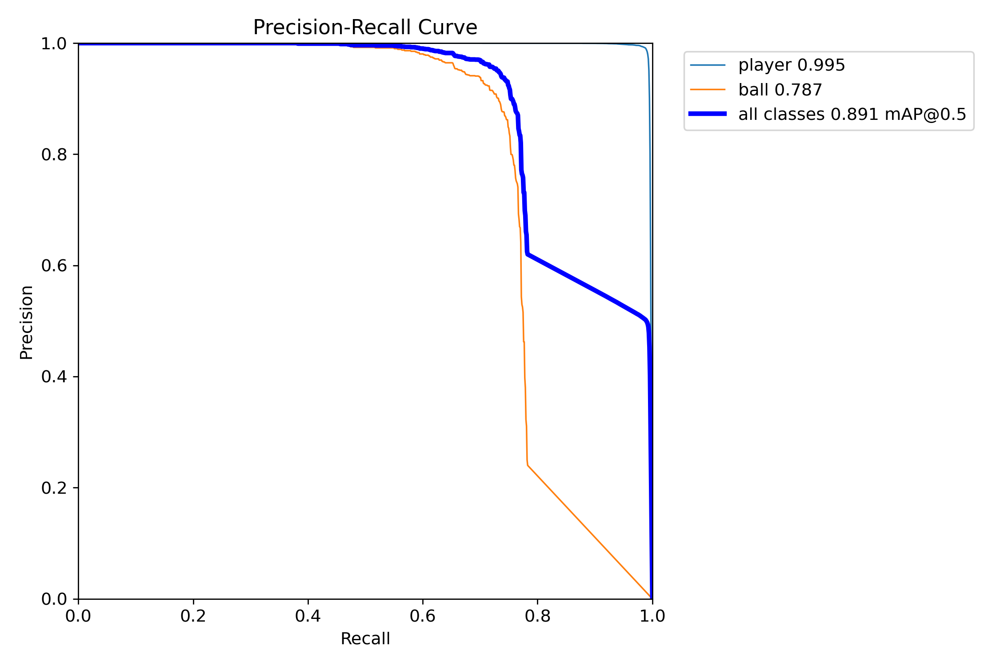
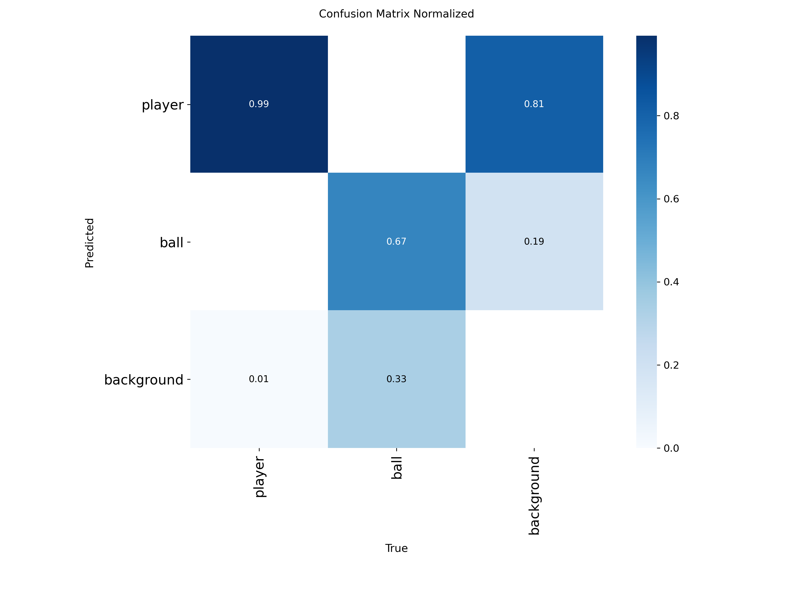
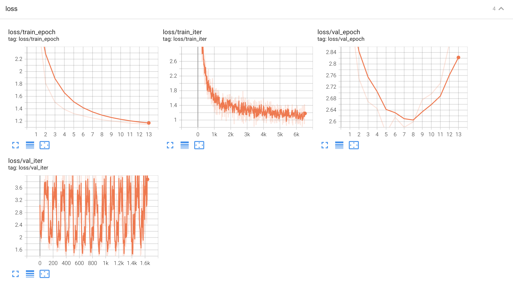
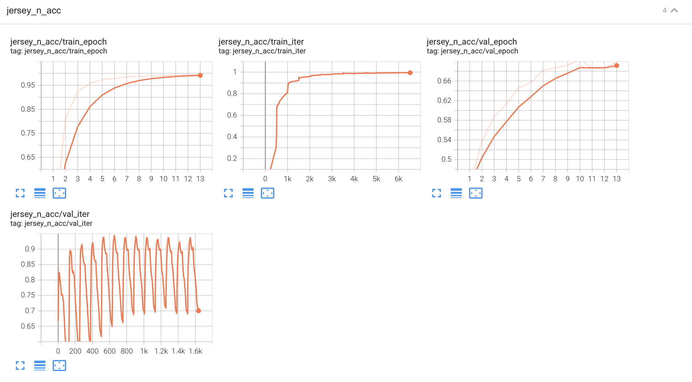
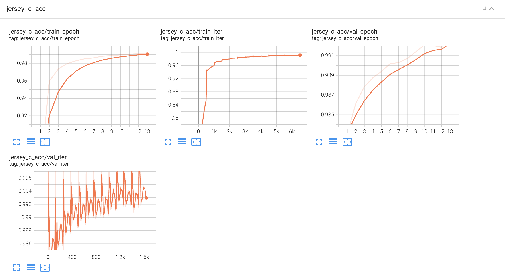
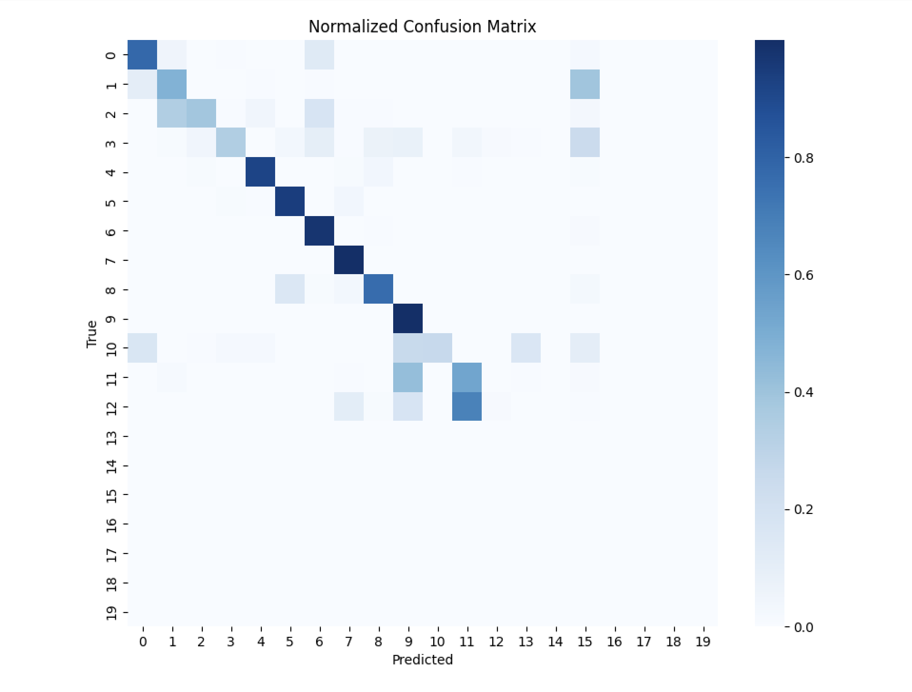

# ⚽ Football Two-Pipeline: Object Detection & Classification

A two-stage pipeline for football match video analysis that combines **YOLOv26s** for player/ball detection with a custom **EfficientNetV2-S** multi-task classifier for jersey number recognition, team color identification, and number visibility prediction.

<p align="center">
  
</p>

---

## 📋 Table of Contents

- [Pipeline Architecture](#-pipeline-architecture)
- [Project Structure](#-project-structure)
- [Requirements](#-requirements)
- [Dataset](#-dataset)
- [Training](#-training)
  - [Stage 1 — Object Detection](#stage-1--object-detection-yolov26s)
  - [Stage 2 — Player Classification](#stage-2--player-classification-efficientnetv2-s)
- [Inference](#-inference)
- [Results](#-results)
  - [Detection Results](#detection-results)
  - [Classification Results](#classification-results)
- [Author](#-author)

---

## 🏗 Pipeline Architecture

```
Input Video
    │
    ▼
┌─────────────────────────┐
│   Stage 1: Detection    │
│       YOLOv26s          │
│  (Player & Ball)        │
└────────────┬────────────┘
             │
     ┌───────┴───────┐
     │               │
  Player           Ball
  Crops          (pass through)
     │
     ▼
┌─────────────────────────┐
│  Stage 2: Classification│
│   EfficientNetV2-S      │
│   Multi-Task Heads:     │
│   ├─ Jersey Number (20) │
│   ├─ Team Color (2)     │
│   └─ Number Visible (2) │
└────────────┬────────────┘
             │
             ▼
      Annotated Video
  (team, number, status)
```

---

## 📁 Project Structure

```
Football/
├── src/
│   ├── classification/
│   │   ├── efficientnetv2_custom.py    # Multi-head EfficientNetV2-S model
│   │   └── classification_dataset.py  # Dataset for jersey classification
│   └── detection/
│       ├── converter.py               # COCO JSON → YOLO format converter
│       ├── detection_dataset.py       # Detection dataset class
│       ├── run_converter.py           # Script to run data conversion
│       └── example_yaml.yaml          # Example data config
│
├── train_detection.py                 # YOLOv26s training script
├── train_classification.py            # EfficientNetV2-S training script
├── detection_inference.py             # Detection-only inference
├── model_inference.py                 # Full two-pipeline inference
│
├── yolo26s_model/                     # Pre-trained YOLOv26s weights
├── yolo26s_trained/                   # Trained detection weights
├── efficientnetv2s_model/             # Pre-trained EfficientNetV2-S weights
├── efficientnetv2s_trained/           # Trained classification weights
│
├── model_results/
│   ├── detection_results/
│   │   ├── metrics/                   # Training curves, PR curves, confusion matrix
│   │   └── detection_test_ouputs/     # Detection-only output videos
│   └── classification_results/
│       └── classification_tensorboard/ # TensorBoard logs & screenshots
│
├── test_video/                        # Sample test video
└── assets/                            # README assets
```

---

## 📦 Requirements

- Python 3.10+
- CUDA-compatible GPU (trained on **2× NVIDIA RTX 3090 24GB**)

### Dependencies

```bash
pip install torch torchvision
pip install ultralytics
pip install opencv-python
pip install scikit-learn
pip install tensorboard
pip install matplotlib seaborn
pip install tqdm
```

---

## 📊 Dataset

> **Note:** The dataset used in this project is **private** and not publicly available.

### Format

- **Detection:** Video frames with COCO-style JSON annotations, converted to YOLO format
  - `category_id: 4` → Player (class 0)
  - `category_id: 3` → Ball (class 1)

- **Classification:** Cropped player regions from video frames with attributes:
  - `jersey_number`: 1–20
  - `team_jersey_color`: white / black
  - `number_visible`: visible / invisible

### Data Configuration (`football_data.yaml`)

```yaml
path: Dataset/Football
train: football_train/images
val: football_val/images
test: football_test/images

nc: 2

names:
  0: player
  1: ball
```

---

## 🏋️ Training

### Stage 1 — Object Detection (YOLOv26s)

```bash
python train_detection.py \
    --data_path src/football_data.yaml \
    --epochs 200 \
    --batch_size 4 \
    --img_sz 1920 \
    --lr 1e-3 \
    --optimizer AdamW \
    --weight_decay 1e-5
```

| Hyperparameter | Value |
|:---|:---|
| Model | YOLOv26s |
| Image Size | 1920 |
| Optimizer | AdamW |
| Learning Rate | 1e-3 |
| Weight Decay | 1e-5 |
| Cosine LR | ✅ |
| Patience (Early Stop) | 20 |
| Multi-GPU | 2× RTX 3090 |

**Resume from checkpoint:**
```bash
python train_detection.py \
    --data_path src/football_data.yaml \
    --last_model yolo26s_trained/last.pt
```

---

### Stage 2 — Player Classification (EfficientNetV2-S)

```bash
python train_classification.py \
    --data_path /path/to/dataset \
    --epochs 200 \
    --batch_size 16 \
    --learning_rate 1e-4 \
    --weight_decay 2e-3
```

| Hyperparameter | Value |
|:---|:---|
| Backbone | EfficientNetV2-S (ImageNet pretrained) |
| Input Size | 224 × 224 |
| Optimizer | AdamW |
| LR (Backbone) | 1e-5 |
| LR (3 Heads) | 1e-4 |
| Scheduler | CosineAnnealingLR |
| Label Smoothing | 0.1 (jersey number head) |
| Early Stopping | patience=3 |
| Multi-GPU | 2× RTX 3090 |

**Multi-task loss:**
```
Total Loss = Jersey Number Loss + 0.05 × Jersey Color Loss + Visibility Loss
```

**Data augmentation:**
- ColorJitter, RandomAffine, RandomPerspective, RandomErasing
- Class-weighted CrossEntropy for jersey number & visibility heads

---

## 🔮 Inference

### Detection Only

```bash
python detection_inference.py \
    --video_path test_video/Match_1864_1_0_subclip.mp4 \
    --best_model yolo26s_trained/best.pt \
    --conf 0.25 \
    --img_size 1280
```

### Full Two-Pipeline (Detection + Classification)

```bash
python model_inference.py \
    --detection_model yolo26s_trained/best.pt \
    --classification_model efficientnetv2s_trained/best.pt \
    --test_video test_video/Match_1864_1_0_subclip.mp4 \
    --conf_threshold 0.3 \
    --img_size 1280
```

**Output format per player:**
```
jersey_number | confidence | status: visible/invisible
team is the color of bounding box
```

---

## 📈 Results

### Detection Results

#### Training Curves

<p align="center">
  
</p>

#### Precision-Recall Curve

<p align="center">
  
</p>

| Class | mAP@50 |
|:---|:---:|
| **Player** | **0.995** |
| **Ball** | **0.787** |
| **All Classes** | **0.891** |

#### Confusion Matrix

<p align="center">
  
</p>

#### Detection-Only Output

<p align="center">
  
</p>

---

### Classification Results

#### Loss Curves (TensorBoard)

<p align="center">
  
</p>

#### Jersey Number Accuracy

<p align="center">
  
</p>

| Metric | Train | Validation |
|:---|:---:|:---:|
| Jersey Number Acc | ~0.98 | **~0.70** |

#### Jersey Color Accuracy

<p align="center">
  
</p>

| Metric | Train | Validation |
|:---|:---:|:---:|
| Jersey Color Acc | ~0.99 | **~0.99** |

#### Jersey Number Confusion Matrix

<p align="center">
  
</p>

---

### Full Pipeline Output

<p align="center">
  
</p>

---

## 👤 Author

**Minh Hung Le – Elias**
